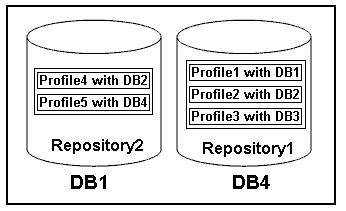

= What profiles are
:icons: font
:imagesdir: ../media/

[.lead]
SnapManager uses profiles to store the information necessary to perform operations on a given database. A profile contains the information about the database including its credentials, backups, and clones. By creating a profile, you do not have to specify database details each time you perform an operation on that database.

A profile can reference only one database. The same database can be referenced by more than one profile. Backups created using one profile cannot be accessed from a different profile, even if both the profiles reference the same database.

Profile information is stored in a repository. The repository contains both the profile information for the database and information about the Snapshot copies that serve as the database backup. The actual Snapshot copies are stored on the storage system. The Snapshot copy names are stored in the repository containing the profile for that database. When you perform an operation on a database, you must select the profile from the repository.

The following figure illustrates how repositories can hold multiple profiles, but also that each profile can define only one database:

In the preceding example, Repository2 is on database DB1 and Repository1 is on the database DB4.

Each profile contains the credentials for the database associated with the profile. The credentials enable SnapManager to connect to and work with the database. The stored credentials include the user name and password pairs for accessing the host, the repository, the database, and the required connection information if you are using Oracle Recovery Manager (RMAN).

You cannot access a backup that was created using one profile from a different profile, even if both the profiles are associated with the same database. SnapManager places a lock on the database to prevent two incompatible operations from being performed simultaneously.

*Profile for creating full and partial backups*

You can create profiles to take full backups or partial backups.

The profiles that you specify to create the full and partial backups contain both the data files and archive log files. SnapManager does not allow such profiles to separate the archive log backups from the data file backups. The full and partial backups are retained based on the existing backup retention policiesand protected based on the existing protection policies. You can schedule full and partial backups based on the time and frequency that suits you.

*Profiles for creating data files-only backups and archive log-only backups*

SnapManager (3.2 or later) allows you to create profiles that take backups of the archive log files separately from the data files. After you use the profile to separate the backup types, you can create either data files-only backups or archive log-only backups of the database. You can also create a backup containing both the data files and archive log files together.

The retention policy applies to all the database backups when the archive log backups are not separated. After you separate the archive log backups, SnapManager allows you to specify different retention durations and protection policies for the archive log backups.

*Retention policy*

SnapManager determines whether a backup should be retained by considering both the retention count (for example, 15 backups) and the retention duration (for example, 10 days of daily backups). A backup expires when its age exceeds the retention duration set for its retention class and the number of backups exceeds the retention count. For example, if the backup count is 15 (meaning that SnapManager has taken 15 successful backups) and the duration requirement is set for 10 days of daily backups, the five oldest, successful, and eligible backups expire.

*Archive log retention duration*

After the archive log backups are separated, they are retained based on the archive log retention duration. Archive log backups taken with data file backups are always retained along with those data file backups, regardless of the archive log retention duration.
