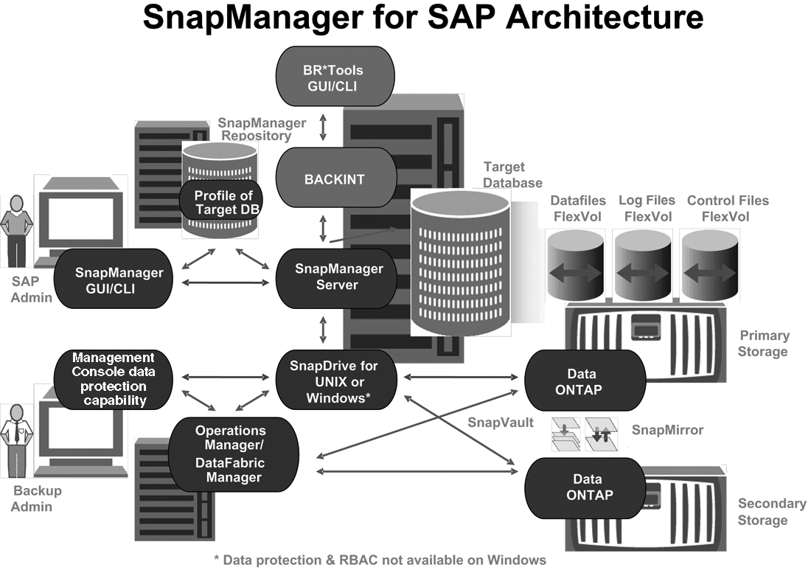

= Primary and secondary storage configuration and topology
:icons: font
:imagesdir: ../media/

[.lead]
In this example, the TechCo corporation runs its payroll database on a database server that is also a SnapManager for SAP host and stores its payroll database data and configuration files on primary storage systems at company headquarters. The corporate requirement is to protect that database with daily and weekly backups to local storage as well as backups to storage systems at a secondary storage site fifty miles away.

The following illustration shows the SnapManager for SAP and the NetApp Management Console data protection capability components required to support local and secondary backup protection.

To manage the payroll database and support its local and secondary backup protection as illustrated in the previous graphic, the following deployment is used.

* *SnapManager host*
+
The SnapManager host, payroll.techco.com, is located at company headquarters and runs on a UNIX server, which also runs the database program that generates and maintains the payroll database.

 ** *Connections*
+
To support local backup and secondary backup protection, the SnapManager host has network connections to the following components:

  *** SnapManager for SAP client
  *** SnapManager repository, which runs the database program, SnapDrive for UNIX, and SnapManager
  *** Primary storage systems
  *** Secondary storage systems
  *** DataFabric Manager server

 ** *Installed products*
+
The SnapManager host is installed with the following products for this example:

  *** SnapManager server
  *** SnapDrive for UNIX
  *** Host Utilities

* *TechCo primary storage systems*
+
The payroll database, including associated data files, log files, and control files, reside on the primary storage systems. These are located at TechCo company headquarters along with the SnapManager host and the network connecting primary storage and the SnapManager host. The latest payroll database transactions and updates are written to the primary storage systems. Snapshot copies, which provide local backup protection of the payroll database, also reside on the primary storage systems.

 ** *Connections*
+
To support secondary backup protection, the primary storage systems have network connections to the following components:

  *** SnapManager host running the database program, SnapDrive for UNIX, and SnapManager
  *** Secondary storage systems
  *** DataFabric Manager server

 ** *Installed products*
+
The following licenses must be enabled on these systems for this example:

  *** Data ONTAP 7.3.1 or later
  *** SnapVaultData ONTAP Primary
  *** FlexVol (required for NFS)
  *** SnapRestore
  *** NFS protocol

* *TechCo secondary storage systems*
+
The secondary storage systems, located at a network-connected secondary storage site fifty miles away, are used to store secondary backups of the payroll database.

 ** *Connections*
+
To support secondary backup protection, the secondary storage systems have network connections to the following components:

  *** Primary storage systems
  *** DataFabric Manager server

 ** *Installed products*
+
The following licenses must be enabled on the secondary storage systems for this example:

  *** Data ONTAP
  *** SnapVaultData ONTAP Secondary
  *** SnapRestore
  *** FlexVol (required for NFS)
  *** NFS protocol

* *DataFabric Manager server*
+
The DataFabric Manager server, techco_dfm, is located at company headquarters in a location accessible by the storage administrator. The DataFabric Manager server, among other functions, coordinates the backup tasks between primary and secondary storage.

 ** *Connections*
+
To support secondary backup protection, the DataFabric Manager server maintains network connections to the following components:

  *** NetApp Management Console
  *** Primary storage systems
  *** Secondary storage systems

 ** *Installed products*
+
The DataFabric Manager server is licensed for the following server products for this example:

  *** DataFabric Manager

* *SnapManager repository*
+
The SnapManager repository, located on a dedicated server, stores data about operations performed by SnapManager, for example the time of backups, tablespaces and datafiles backed up, storage systems used, clones made, and Snapshot copies created. When a DBA attempts a full or partial restore, SnapManager queries the repository to identify backups that were created by SnapManager for SAP for restoration.

 ** *Connections*
+
To support secondary backup protection, the secondary storage systems have network connections to the following components:

  *** SnapManager host
  *** SnapManager for SAP client

* *NetApp Management Console*
+
The NetApp Management Console is the graphical user interface console used by the storage administrator to configure schedules, policies, datasets, and resource pool assignments to enable backup to secondary storage systems, which are accessible to the storage administrator.

 ** *Connections*
+
To support secondary backup protection, NetApp Management Console has network connections to the following components:

  *** Primary storage systems
  *** Secondary storage systems
  *** DataFabric Manager server

* *SnapManager for SAP client*
+
The SnapManager for SAP client is the graphical user interface and command line console used by the DBA for the payroll database in this example to configure and carry out local backup and backup to secondary storage.

 ** *Connections*
+
To support local backup and secondary backup protection, SnapManager for SAP client has network connections to the following components:

  *** SnapManager host
  *** SnapManager repository, running the database program, SnapDrive for UNIX, and SnapManager
  *** Database host (if separate from the host running SnapManager)
  *** DataFabric Manager server

 ** *Installed products*
+
To support local backup and secondary backup protection, the SnapManager for SAP client software must be installed on this component.
