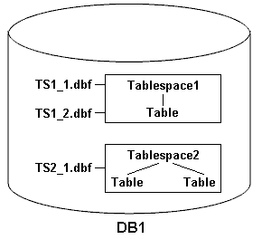

= Examples of backup, restore, and recover operations
:icons: font
:imagesdir: ../media/

[.lead]
You can find information about some of the backup, restore, and recover scenarios that you can use to accomplish your data protection goals.

The following illustration shows the contents of the tablespace:

In the illustration, Tablespace1 has one table and two database files associated with it. Tablespace2 has two tables and one database file associated with it.

The following tables describe some full and partial backup, restore, and recover scenarios:

== Examples of full backup, restore, and recover operations

|===
| Full backup| Restore| Recover
a|
SnapManager makes a backup of everything in database DB1, including the data files, archive logs, and control files.
a|
Complete restore with control files SnapManager restores all data files, tablespaces, and control files in the backup.

a|
You can specify one of the following:

* SCN - Enter an SCN, such as 384641.
* Date/Time - Enter a date and time of the backup, such as 2005-11-25:19:06:22.
* The last transaction made to the database.

a|
Complete restore without control files SnapManager restores all tablespaces and data files, without the control files.

a|
Restore either data files or tablespaces with control files Specify one of the following:

* Tablespaces
* Data files

a|
SnapManager recovers the data to the last transaction made to the database.
a|
Restore either data files or tablespaces without control filesSnapManager restores one of the following:

* Tablespaces
* Data files

a|
Restore control files only
|===

== Examples of partial backup, restore, and recover operations

|===
| Partial backup| Restore| Recover
a|
You can choose one of the following options:

* Tablespaces
+
You can specify Tablespace1 and Tablespace2 or only one of them.

* Data files
+
You can specify all three database files (TS1_1.dbf, TS1_2.dbf, and TS2_1.dbf), two files, or one file.

Regardless of which option you select, the backup includes all the control files. Archive log files are included in the partial backup if the profile is not enabled to create the archive log backups separately.

a|
Complete restore SnapManager restores all data files, tablespaces, and control files specified in the partial backup.

a|
SnapManager recovers the data to the last transaction made to the database instance.
a|
Restore either data files or tablespaces with control files SnapManager restores one of the following:

* All the data files specified
* All the tablespaces specified

a|
Restore either data files or tablespaces without control files SnapManager restores one of the following:

* Tablespaces
+
Specify any of the tablespaces. SnapManager restores only the tablespaces specified. If the backup contains Tablespace1, SnapManager restores only that tablespace.

* Data files
+
Specify any of the database files. SnapManager restores only the data files specified. If the backup contains database files (TS1_1.dbf and TS1_2.dbf), SnapManager restores only those files.

a|
Restore control files only
|===
