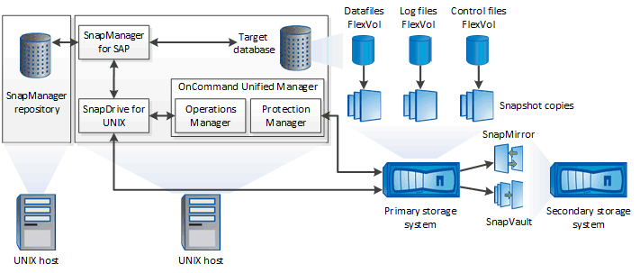

= SnapManager architecture
:icons: font
:imagesdir: ../media/

[.lead]
SnapManager for SAP includes components that work together to provide a comprehensive and powerful backup, restore, recovery, and cloning solution for Oracle databases.

== SnapDrive for UNIX

SnapManager requires SnapDrive to establish connection with the storage system. You must install SnapDrive for UNIX on every target database host before installing SnapManager.

== SnapManager for SAP

You must install SnapManager for SAP on every target database host.

You can either use the command-line interface (CLI) or UI from the database host where SnapManager for SAP is installed. You can also use the SnapManager UI remotely by using a web browser from any system running on an operating system supported by SnapManager.

NOTE: The supported JRE version is 1.8.

== Target database

The target database is an Oracle database that you want to manage using SnapManager by performing backup, restore, recovery, and clone operations.

The target database can be a standalone, Real Application Clusters (RAC), or reside on Oracle Automatic Storage Management (ASM) volumes. For details about the supported Oracle database versions, configurations, operating systems, and protocols, see the NetApp Interoperability Matrix Tool.

== SnapManager repository

The SnapManager repository resides in an Oracle database and stores metadata about profiles, backups, restore, recovery, and clone. A single repository can contain information about operations performed on multiple database profiles.

The SnapManager repository cannot reside in the target database. The SnapManager repository database and the target database must be online before performing SnapManager operations.

== OnCommand Unified Manager Core Package

OnCommand Unified Manager core package integrates the capabilities of Operations Manager, Protection Manager, and Provisioning Manager. It centralizes provisioning, cloning, backup and recovery, and disaster recovery (DR) policies. Integrating all of these capabilities makes it possible to perform many management functions from a single tool.

== Operations Manager

Operations Manager is the web-based user interface (UI) of the OnCommand Unified Manager core package. It is used for day-to-day storage monitoring, issue alerts, and reporting on storage and storage system infrastructure. SnapManager integration leverages the RBAC capabilities of Operations Manager.

== Protection Manager

Protection Manager gives administrators an easy-to-use management console for quick configuration and control of all SnapMirror and SnapVault operations. The application allows administrators to apply consistent data protection policies, automate complex data protection processes, and pool backup and replication resources for higher utilization.

The interface for Protection Manager is the NetApp Management Console, the client platform for NetApp management software applications. TheNetApp Management Console runs on a Windows or Linux system that is different from the server on which the OnCommand server is installed. It enables storage, application, and server administrators to perform daily tasks without having to switch between different UIs. The applications that run in the NetApp Management Console are Protection Manager, Provisioning Manager, and Performance Advisor.

== Primary storage system

SnapManager backs up the target databases on the primary NetApp storage system.

== Secondary storage system

When you enable data protection on a database profile, the backups created on the primary storage system by SnapManager are replicated to a secondary NetApp storage system using SnapVault and SnapMirror technologies.

*Related information*

http://mysupport.netapp.com/matrix[NetApp Interoperability Matrix Tool]
