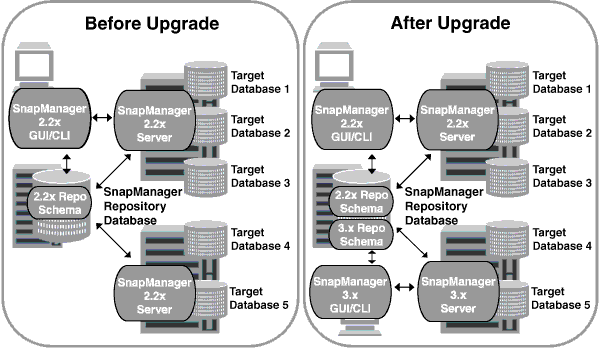

= Upgrading SnapManager hosts by using rolling upgrade
:icons: font
:imagesdir: ../media/

[.lead]
The rolling upgrade approach that enables you to upgrade the hosts in a staggered, host-by-host manner is supported from SnapManager 3.1.

SnapManager 3.0 or earlier only enabled you to upgrade all the hosts simultaneously. This resulted in downtime of all the SnapManager hosts and the scheduled operations during upgrade operation.

Rolling upgrade provides the following benefits:

* Improved SnapManager performance because only one host is upgraded at one time.
* Ability to test the new features in one SnapManager server host before upgrading the other hosts.

NOTE: You can perform rolling upgrade only by using the command-line interface (CLI).

After successful completion of rolling upgrade, the SnapManager hosts, profiles, schedules, backups, and clones associated with the profiles of the target databases are migrated from the repository database of the earlier SnapManager version to the repository database of the new version. The details about the operations performed by using the profiles, schedules, backups, and clones that were created in the earlier SnapManager version are now available in the repository database of the new version. You can start the GUI by using the default configuration values of the `user.config` file. The values configured in the `user.config` file of the earlier version of SnapManager are not considered.

The upgraded SnapManager server can now communicate with the upgraded repository database. The hosts that were not upgraded can manage their target databases by using the repository of the earlier version of SnapManager and thereby can use the features available in the earlier version.

NOTE: Before performing rolling upgrade, you must ensure that all the hosts under the repository database can be resolved. For information about how to resolve the hosts, see the troubleshooting section in _SnapManager for SAP Administration Guide for UNIX_.

*Related information*

https://library.netapp.com/ecm/ecm_download_file/ECMP12481453[SnapManager 3.4.1 for SAP Administration Guide for UNIX^]
