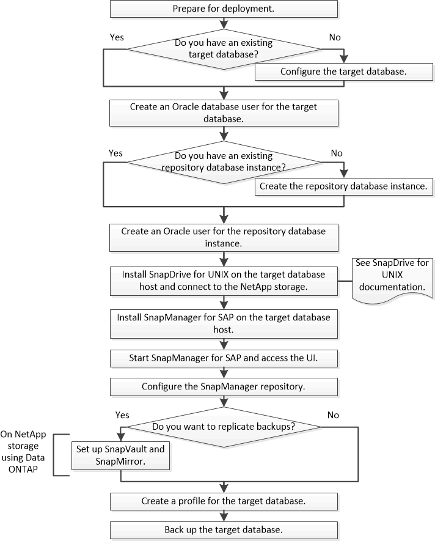

= Deployment workflow
:icons: font
:imagesdir: ../media/

[.lead]
Before you can create backups with SnapManager, you need to first install SnapDrive for UNIX and then install SnapManager for SAP.

