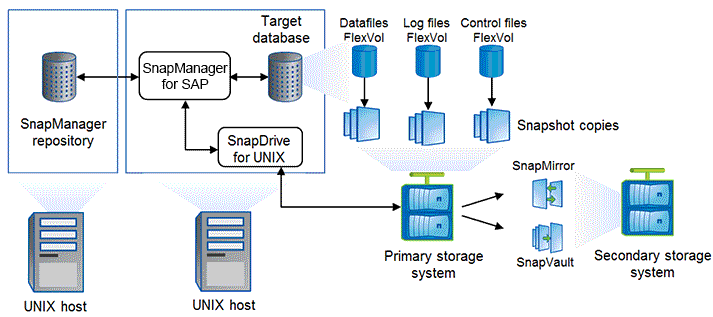

= SnapManager architecture
:icons: font
:imagesdir: ../media/

[.lead]
SnapManager for SAP includes components that work together to provide a comprehensive and powerful backup, restore, recovery, and cloning solution for Oracle databases.

== SnapDrive for UNIX

SnapManager requires SnapDrive to establish connection with the storage system. You must install SnapDrive for UNIX on every target database host before installing SnapManager.

== SnapManager for SAP

You must install SnapManager for SAP on every target database host.

You can either use the command-line interface (CLI) or UI from the database host where SnapManager for SAP is installed. You can also use the SnapManager UI remotely by using a web browser from any system running on an operating system supported by SnapManager.

NOTE: The supported JRE version is 1.8.

== Target database

The target database is an Oracle database that you want to manage using SnapManager by performing backup, restore, recovery, and clone operations.

The target database can be a standalone, Real Application Clusters (RAC), or reside on Oracle Automatic Storage Management (ASM) volumes. For details about the supported Oracle database versions, configurations, operating systems, and protocols, see the NetApp Interoperability Matrix Tool.

== SnapManager repository

The SnapManager repository resides in an Oracle database and stores metadata about profiles, backups, restore, recovery, and clone. A single repository can contain information about operations performed on multiple database profiles.

The SnapManager repository cannot reside in the target database. The SnapManager repository database and the target database must be online before performing SnapManager operations.

== Primary storage system

SnapManager backs up the target databases on the primary NetApp storage system.

== Secondary storage system

When you enable data protection on a database profile, the backups created on the primary storage system by SnapManager are replicated to a secondary NetApp storage system using SnapVault and SnapMirror technologies.

*Related information*

http://mysupport.netapp.com/matrix[NetApp Interoperability Matrix Tool]
